Ce plugin permet d’envoyer un évènement à IFTTT

Configuration du plugin 
=======================

Après téléchargement du plugin il vous faut l’activer, celui-ci ne
nécessite aucune autre configuration.

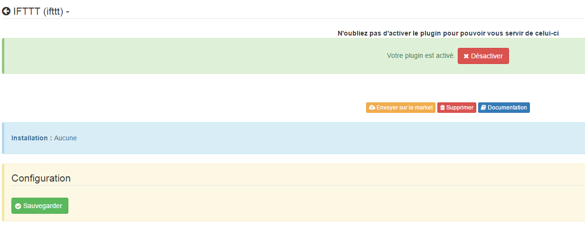

Configuration des équipements 
=============================

La configuration des équipements IFTTT est accessible à partir du menu
plugins :

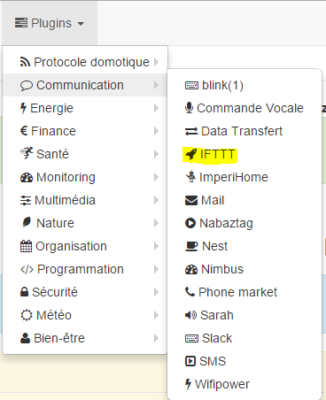

Voilà à quoi ressemble la page du plugin IFTTT (ici avec déjà 1
équipement) :

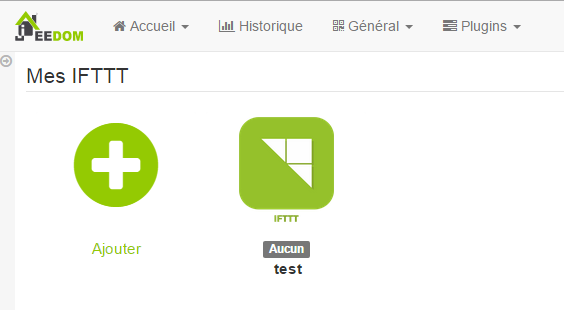

> **Tip**
>
> Comme à beaucoup d’endroits sur Jeedom, mettre la souris tout à gauche
> permet de faire apparaître un menu d’accès rapide (vous pouvez à
> partir de votre profil le laisser toujours visible)

Une fois que vous cliquez sur l’un d’eux, vous obtenez :

Hier finden sie die ganze Konfiguration Ihrer Geräte:

-   **Nom de l’équipement** : nom de votre équipement IFTTT

-   **Activer** : permet de rendre votre équipement actif

-   **Visible** : le rend visible sur le dashboard

-   **Clef** : clef IFTTT que vous trouverez dans la configuration du
    service Webhooks (qui remplace channel maker)

En dessous vous retrouvez la configuration des commandes :

-   **Nom** : nom de la commande

-   **Sous-type** : sous-type de l’équipement

-   **Evènement** : nom de l’èvenement configuré dans IFTTT

-   **Valeur** : valeur a envoyer à IFTTT, 3 distinctions possibles, en
    fonction du sous-type vous pouvez utiliser les tags : \#color\#,
    \#slider\#, \#message\# et \#title\#

-   configuration avancée (petites roues crantées) : permet d’afficher
    la configuration avancée de la commande (méthode
    d’historisation, widget…​)

-   Tester : permet de tester la commande

-   supprimer (signe -) : permet de supprimer la commande

Création d’un compte IFTTT 
==========================

Créez un compte sur IFTTT si ce n’est pas déjà fait, en allant sur
[IFTTT](:https://ifttt.com) :

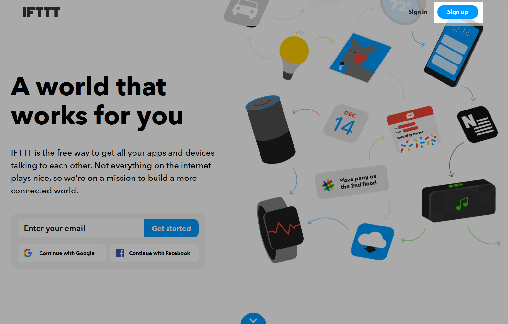

Renseignez votre adresse mail puis votre nom d’utilisateur et faites
créer :

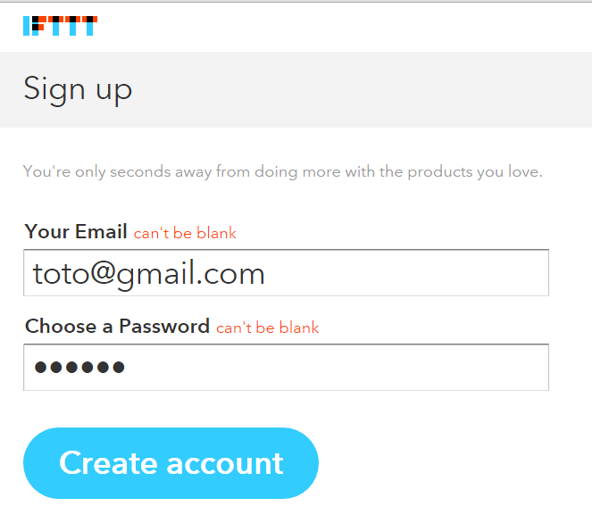

Un petit guide va vous expliquer les possibilités, une fois celui-ci
terminé, cliquez en haut a droite sur search :

Puis dans recherche tapez webhooks et cliquez sur webhooks :

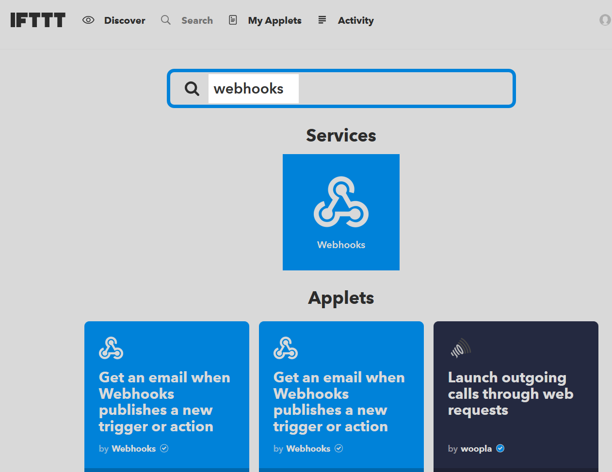

Puis sur connect :

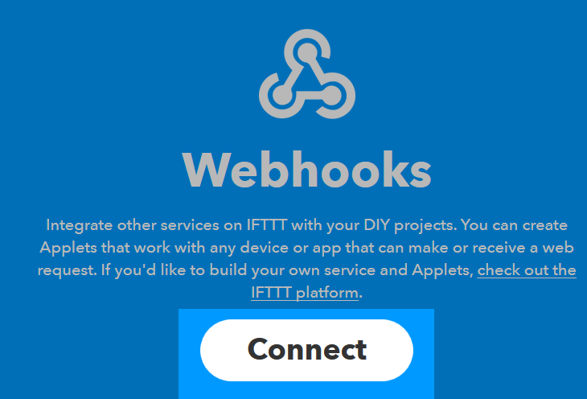

Et là il vous faut récupérer votre clef :

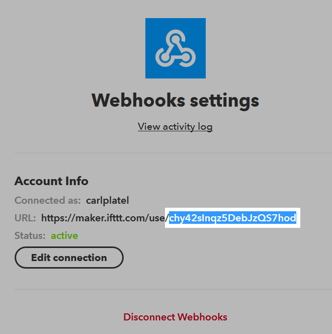

Cette clef est à copier dans le champ "Clef" de votre équipement sous
Jeedom

Création de votre premier "Applet" 
==================================

Pour cela rien de plus simple, dans IFTTT cliquez sur "My applets" puis
sur "New applet"

Puis cliquez sur "New applet" :

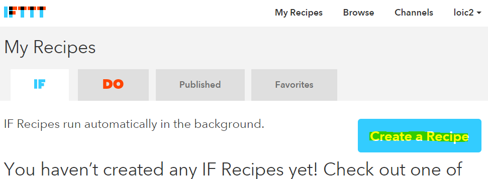

Cliquez sur le "this" :

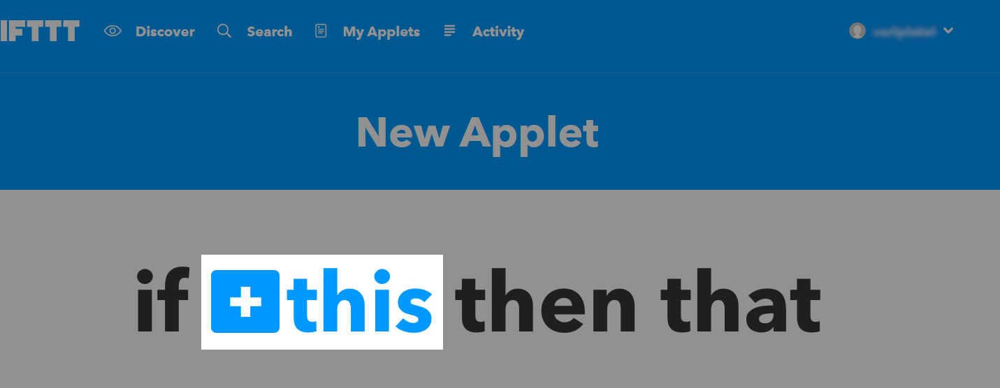

Puis cherchez "Webhooks" et cliquez dessus :

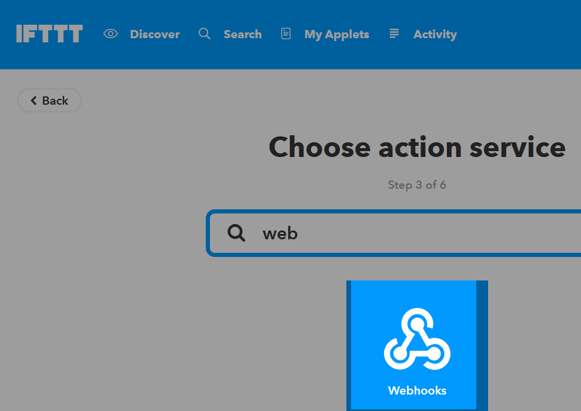

Cliquez sur "Receive a web request"

Donnez un nom à votre "event", attention celui-ci doit correspondre au
nom de l’évènement dans la commande Jeedom, il faut donc bien le
mémoriser, puis validez :

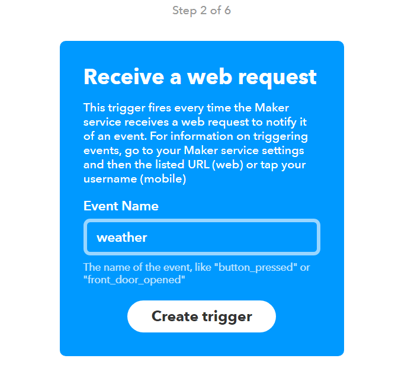

Cliquez ensuite sur le that :

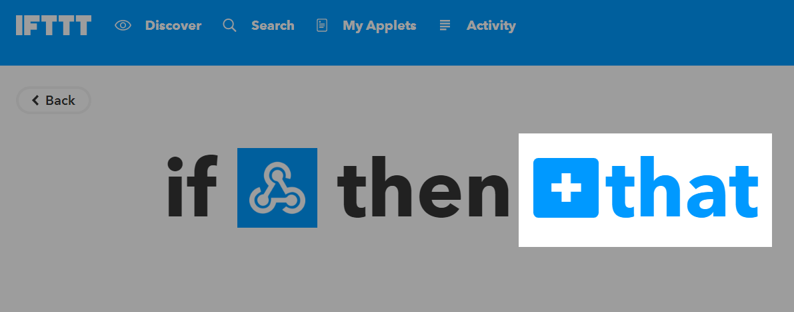

Ensuite à vous de voir, pour l’exemple je vais faire un envoi de
notification sur mon téléphone (il faut au préalable avoir installé
l’application IFTTT dessus), je clique donc sur Notifications :

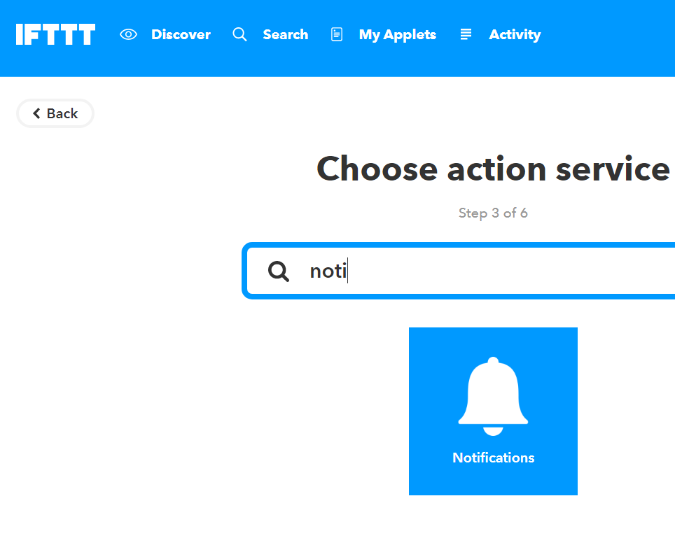

Validez en cliquant sur "Send a notification" (peut changer en fonction
des channels) :

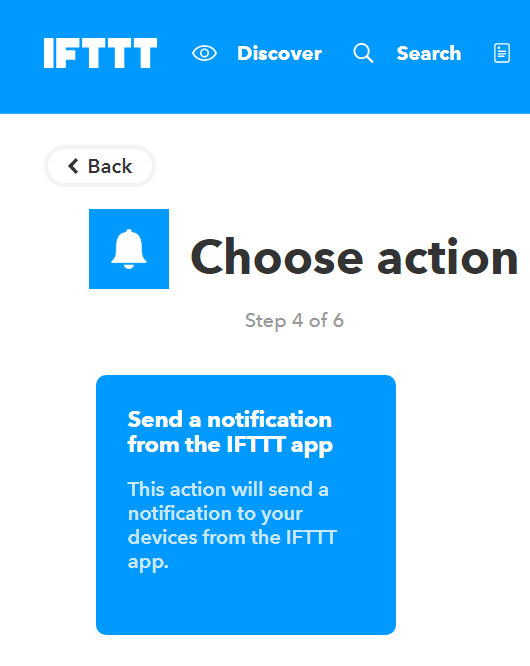

Ensuite il faut écrire le message de la notification, il existe ici des
tags (ingredient) possible :

-   **{{EventName}}** : nom de l’évenement, ici weather

-   **{{Value1}}** : valeur 1 envoyé dans le channel, cela se configure
    sur la commande dans Jeedom

-   **{{Value2}}** : valeur 2 envoyé dans le channel, cela se configure
    sur la commande dans Jeedom

-   **{{Value3}}** : valeur 3 envoyé dans le channel, cela se configure
    sur la commande dans Jeedom

-   **{{OccurredAt}}** : date de l’occurence

Voilà ce que cela donne ici (je veux recevoir la notification de la
méteo en cours chez moi), valider en cliquant sur "Create Action" :

Donnez un nom a votre applet (recette) et validez en cliquant sur
"Create action" :

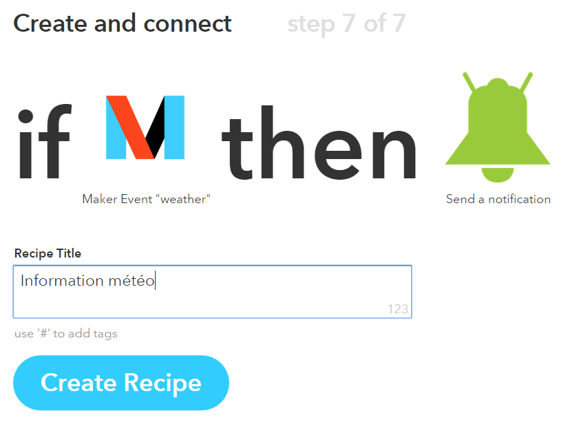

Voilà vous avez créer votre "applets" coté IFTTT :

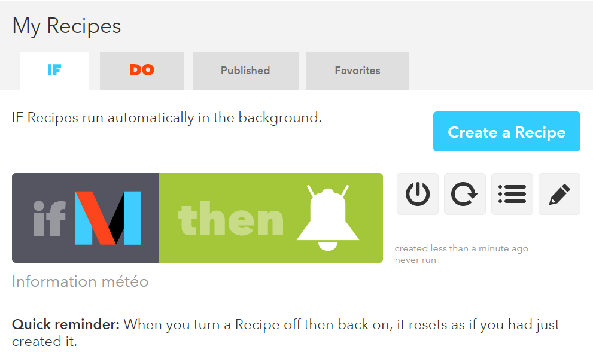

Il reste plus qu’a créer la commande coté Jeedom, c’est assez simple :

Ici rien de particulier, il faut bien remettre le nom de l’évènement
IFTTT dans Jeedom et ensuite mettre les valeurs à passer à IFTTT, ici
les conditions méteo dans l’ingrédient value1

> **Tip**
>
> Coté Jeedom vous pouvez, si vous faites une commande de sous-type
> message par exemple, mettre le tag \#message\# dans un ou plusieurs
> champs "Valeur". Ainsi, dans votre scénario la valeur du message sera
> tranmis à IFTTT. La même chose est possible avec \#title\#, \#color\#,
> \#slider\#

Envoi d’information de IFTTT vers Jeedom 
========================================

Il est aussi possible de faire dans l’autre sens, envoi d’information de
IFTTT vers Jeedom. Voilà comment faire pour par exemple envoyer une
information lorsque le téléphone pénètre dans une zone donnée. Première
chose à faire, créer une nouvelle applet :

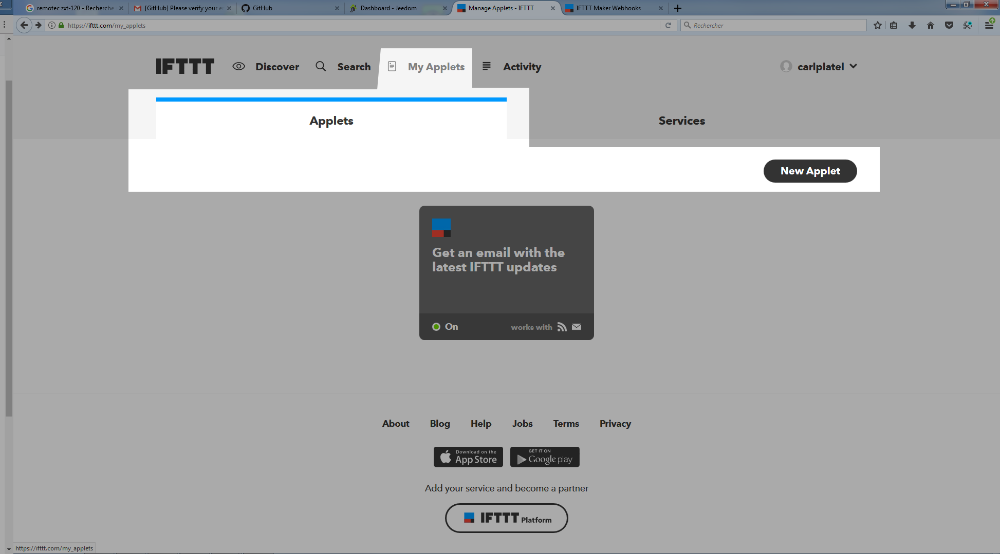

Cliquez ensuite sur le "this" :

Sélectionnez "Location" :

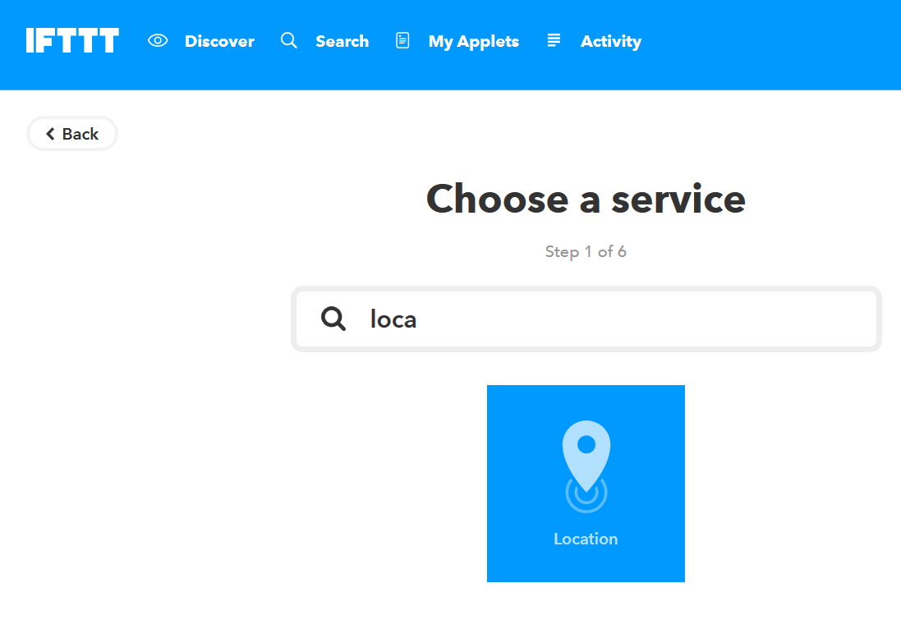

Choisissez votre déclencheur (ici je vais prendre quand on rentre dans
une zone) :

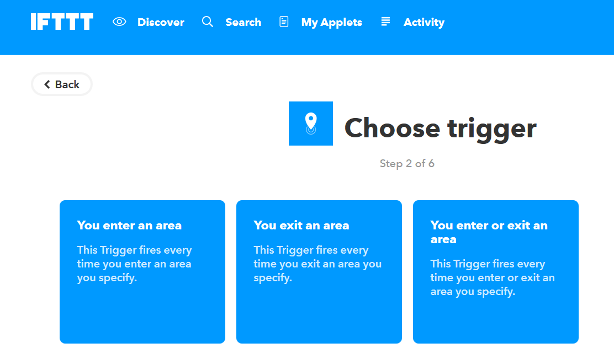

Marquez votre zone puis faites "Create Trigger" :

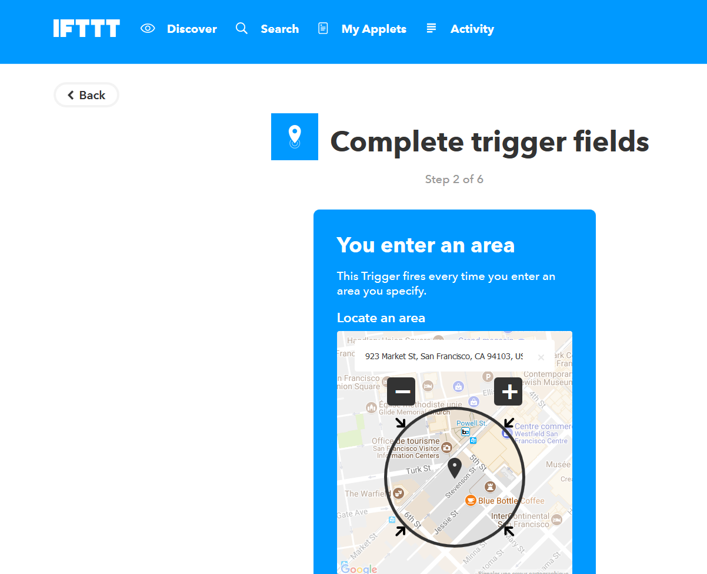

Cliquez sur "that" :

Cherchez "Webhooks" et cliquez dessus :

Cliquez sur "Make a web request" :

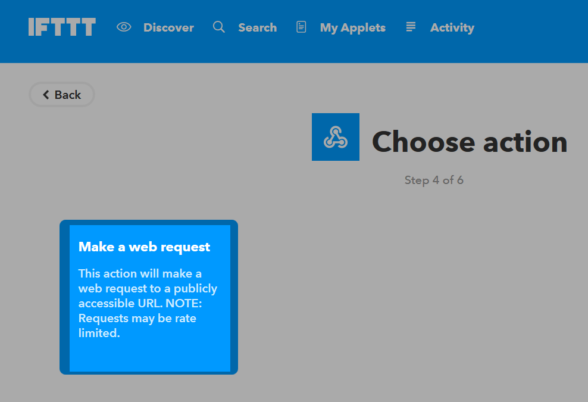

Coté Jeedom, sur votre équipement IFTTT, créer une commande de type
info/autre (ou binaire si vous voulez juste savoir si vous êtês dans la
zone), comme cela :

-   Très important ici : récupérer l’id de la commande (ici 5369).

On retourne ensuite sur IFTTT et dans notre webhooks on va lui donner
l’url à appeller. C’est ici l’étape la plus compliquée, trouver votre
url d’accès externe :

-   Vous utilisez le DNS jeedom alors c’est :
    [https://XXXXX.dns.jeedom.com/core/api/jeeApi.php?apikey=\#APIKEY\#&type=ifttt&id=\#IDCMD\#&value=\#VALEUR\#](https://XXXXX.dns.jeedom.com/core/api/jeeApi.php?apikey=#APIKEY#&type=ifttt&id=#IDCMD#&value=#VALEUR#).
    Attention si vous avez une adresse en /jeedom il faut bien penser à
    la rajouter avant le /core

-   Vous avez votre propre DNS alors l’url est de la forme
    [http://\#VOTRE\_DNS\#/core/api/jeeApi.php?apikey=\#APIKEY\#&type=ifttt&id=\#IDCMD\#&value=\#VALEUR\#](http://#VOTRE_DNS#/core/api/jeeApi.php?apikey=#APIKEY#&type=ifttt&id=#IDCMD#&value=#VALEUR#).
    Attention si vous avez une adresse en /jeedom il faut bien penser à
    la rajouter avant le /core

Pensez bien à remplacer :

-   \#APIKEY\# : par votre clef API JEEDOM (elle se trouve dans Général
    → Administration → Configuration)

-   \#IDCMD\# : par l’id de votre commande précédemment créée

-   \#VALEUR\# : par la valeur que vous voulez donner à votre commande.
    Attention ici les espaces doivent être remplacés par des %20 (et il
    vaut mieux éviter les caractères spéciaux), ex : Hors%20zone

Voilà ce que cela donne :

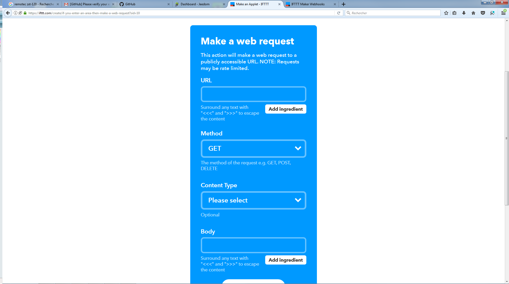

Pensez bien à mettre methode sur Get, puis cliquez sur "Create Action".

Donnez un titre à votre applets puis cliquez sur "Create action". Et
voilà, dès que vous rentrez dans la zone Jeedom sera prévenu.

> **Important**
>
> Il faut aussi faire une recette pour la sortie de zone sinon Jeedom ne
> sera pas prévenu lors de votre sortie de la zone
